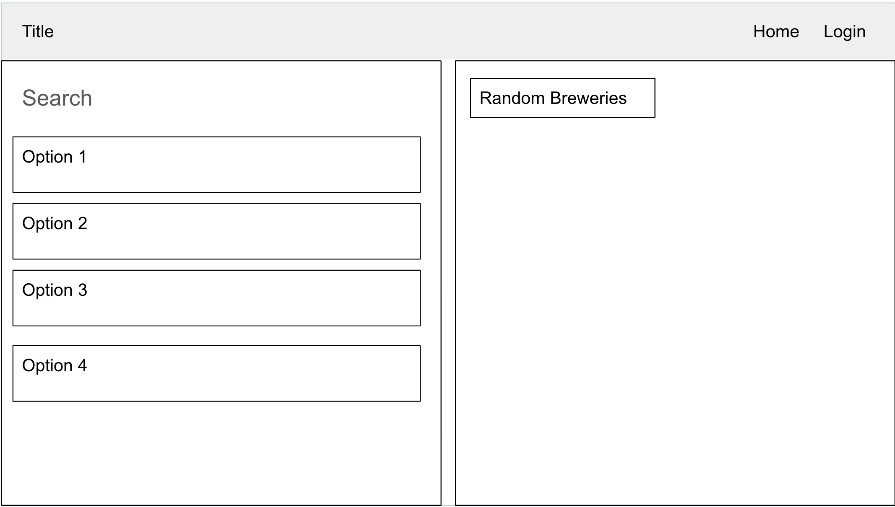
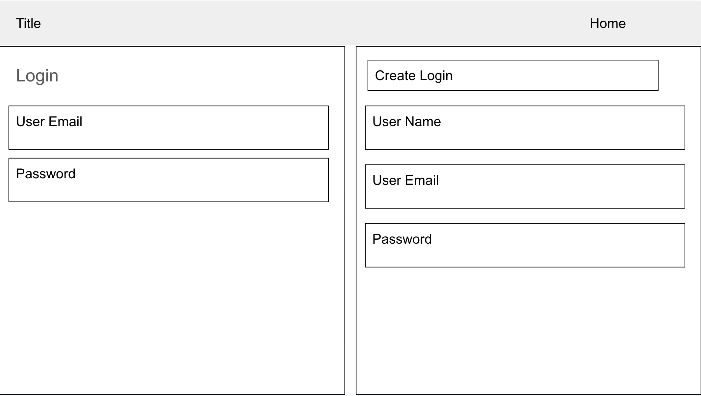
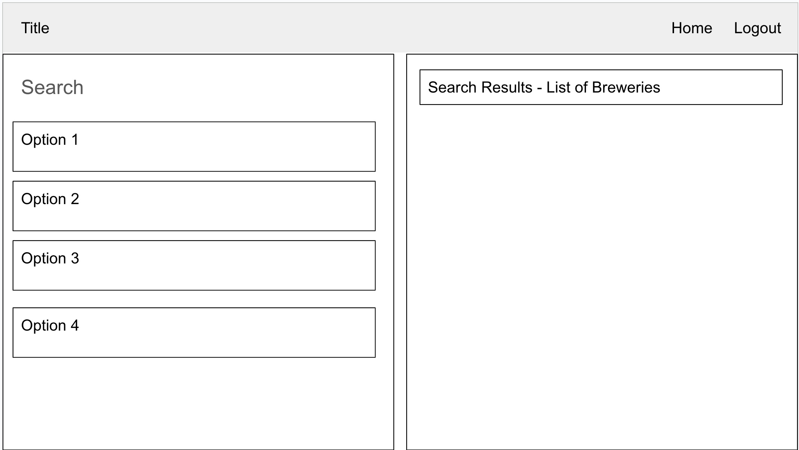
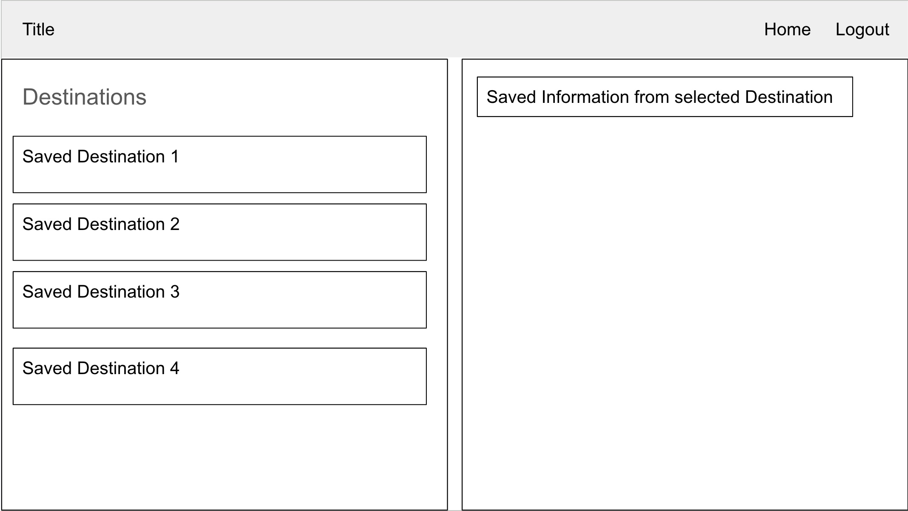
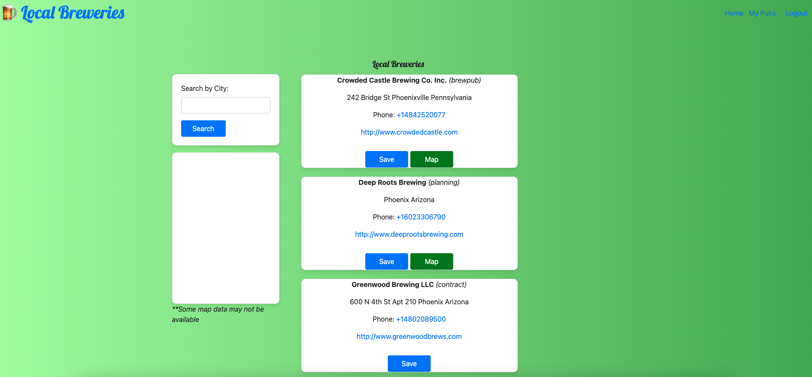

# Local Breweries

## User Story

As a user, I want to:
1. View a list of nearby breweries.
2. Save selected breweries for future reference.
3. Sign in to see a private list of saved breweries.
4. Add comments to or remove breweries from my saved list.

## User Acceptance Criteria

- Display a list of breweries in a specified area.
- Prompt the user to log in before performing searches.
- Allow users to save, comment on, or remove breweries from their saved list.

## Description

LocalBreweries is a web application that allows users to find local breweries, save their favorites, and manage their list of saved breweries. Users can log in to access a personalized list of breweries, add comments, and remove breweries as needed. The application integrates with an external API to fetch brewery data and utilizes the Leaflet open-source map for geographical visualization.

## Content

- [Description](#description)
- [Installation](#installation)
- [License](#license)
- [Contributing](#contributing)
- [Test](#test)
- [Questions](#questions)

## Installation

To run this project locally, you'll need to install the following dependencies:

- express
- mysql2
- sequelize
- dotenv
- handlebars
- express-handlebars
- express-session
- bcrypt

Use the following commands to set up the project:

``npm install express mysql2 sequelize dotenv handlebars express-handlebars express-session bcrypt``

## License

This project is licensed under the ISC license.

## Contributing

We welcome contributions from the community. Please feel free to submit pull requests.

Contributors:
- [SJBDLT](https://github.com/SJBDLT)
- [Bkness](https://github.com/bkness)
- [Shawnclarke21](https://github.com/shawnclarke21)

Server APIs:
- [Open Brewery DB](https://api.openbrewerydb.org)

Coding BootCamp Curriculum:
© 2022 edX Boot Camps LLC. All Rights Reserved.

## Test

We have verified the API calls and ensured that input, update, and deletion operations on the database are functioning correctly.

## Questions

For any questions, please contact us:

- [SJBDLT](https://github.com/SJBDLT) - sblake@blakeis.com
- [Bkness](https://github.com/bkness) - kbrandon863@gmail.com
- [Shawnclarke21](https://github.com/shawnclarke21) - srclark777@gmail.com

Visit our deployed application on Heroku: [LocalBreweries](https://local-breweries-d7e27e181616.herokuapp.com/) 
https://local-breweries-d7e27e181616.herokuapp.com/

Repository: [GitHub](https://github.com/sjbdlt/LocalBreweries.git)

